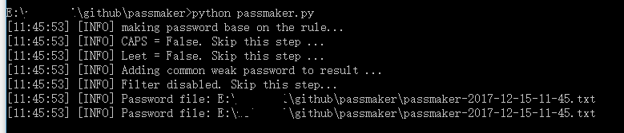
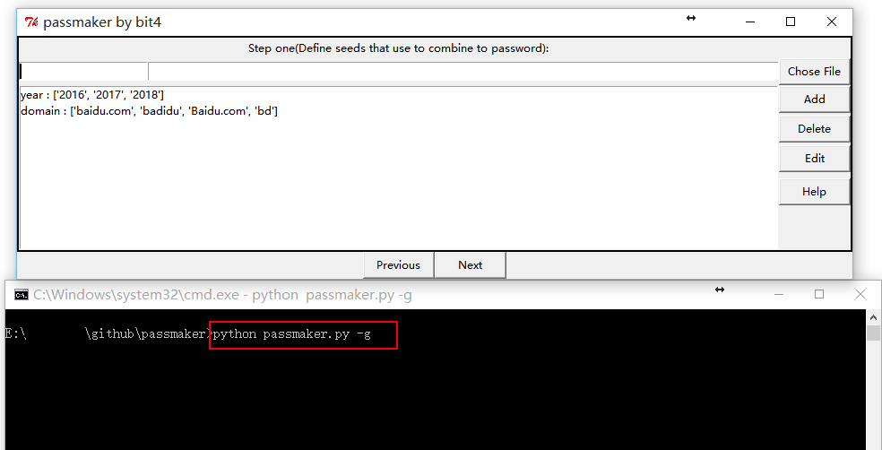

# passmaker

项目地址：<https://github.com/bit4woo/passmaker>

## 0x0、目的

该脚本的主要目标是根据定制的规则来组合生成出密码字典，主要目标是针对企业，希望对安全人员自查“符合密码策略的弱密码”有所帮助。

## 0x1、规则

使用的核心是密码规则的指定，程序将根据你指定的规则来生成密码。比如：

- domain+常规弱密码(666666、88888888)
- domain+键盘弱密码(11qaz2wsx 、zxcv)
- domain+特殊字符(!@#$)+常规弱密码 (666666、88888888)
- domain+特殊字符(!@#$)+年份(2017、2018)
- 等等其他规则

## 0x2、使用

#### **方法一：通过config.py**

通过修改config.py中的参数，然后直接运行`python passmaker.py`来生成密码字典。



其实详细说明已经写在配置文件的注释中了，如下：

```
#第一步，定义种子（seed），密码的基本组成部分，必须是字典类型
domain= ["baidu.com","badidu"]
year = ["2015","2016","2017"]
special_letter = ["!","@","#","$","%",]
keyboard_walk = open('./seed/4_keyboard_walk.txt').readlines()
common_number = open('./seed/common_number.txt').readlines()
chinese_last_name = open('./seed/Chinese_last_name_top100.txt').readlines()
common_english_name = open('./seed/english_name.txt').readlines()


#第二步，定义密码的组成规则，这里用到的seed字段，都必须在第一步中定义好，而且是字典类型
#rule_list = ["domain+special_letter+year","domain+special_letter+keyboard_walk","domain+special_letter+common_number","domain+year","topic+special_letter+year","topic+special_letter+keyboard_walk","topic+special_letter+common_number","topic+year"]
rule_list = ["domain+special_letter+year"]
keep_in_order = True #以上的规则，是否保持原顺序，如果为False 将对每个规则中的seed进行排列组合后生产密码。


#第三步，对以上生成的密码再进行一些变形处理，变形后的密码不会覆盖之前的记录，而是新增一条。
capitalize = False  #是否进行首字母大写处理
leet = False       #是否进行变形处理
leet2num = {"a":"4",
            "i":"1",
            "e":"3",
            "t":"7",
            "o":"0",
            "s":"5",
            "g":"9",
            "z":"2"}

leet2string ={
            "O" : "()",
            "U" : "|_|",
            "D" : "|)",
            "W" : "\/\/",
            "S" : "$",
            }

leet_rule = leet2num #这个配置参数会被用于程序中，上面leet2num、leet2string是为了供你参考


#第四步，将一些常规的，可直接使用的密码字典合入最终的文件中。
additional_list = ["weak_pass_chinese.txt","weak_pass_top100.txt"]

#第五步，也是最后一步，根据以下密码规则约束，对以上生成的密码进行过滤处理，删除不满足条件的
#常见的密码要求：大写字母、小写字母、特殊符号、数字,四种包含三种
enable_filter = False
min_lenth = 1
filter_rule = {"Upper_letter": False, "Lower_letter": True, "Special_char": False, "Nummber": False}
kinds_needed = 3  # 四者包含其三
```


**方法二：命令行交互**

通过运行`python passmaker.py -i`来通过交互模式配置其中参数，然后生成密码字典。


#### 方法三：图形界面

通过运行`python passmaker.py -g` 来启用图形界面配置其中参数，然后运行生成密码字典。



### 0x3、作者

[bit4](https://github.com/bit4woo)

如果有好的建议，欢迎通过issue提交给我，谢谢！